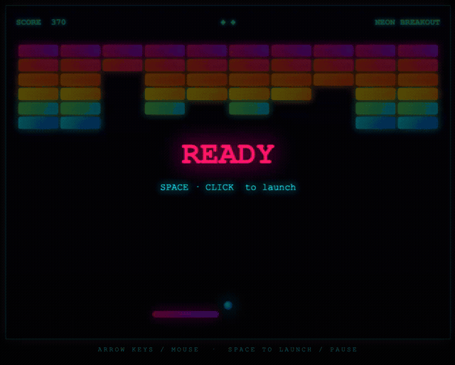

# Breakout (Claude Code, Sonnet 4.6, Sonar MCP)

A premium, arcade-polished Breakout game built with plain HTML5 Canvas — no frameworks, no dependencies.

## About

Classic Breakout mechanics wrapped in a cyberpunk aesthetic: deep-space gradient background with a neon grid overlay, glowing ball, gradient paddle (pink → purple), six rows of per-color neon bricks, and particle explosions when bricks break.

**Controls**

| Input | Action |
|-------|--------|
| Mouse / ← → Arrow Keys | Move paddle |
| Space | Launch ball / Pause |
| Click | Launch ball |

## Vibe-coded with Claude Code + Claude Sonnet 4

This project was fully generated in a single session by [Claude Code](https://claude.com/claude-code) using the **Claude Sonnet 4** model — no manual edits. Code was also automatically analyzed and cleaned by SonarQube during generation (zero issues).

### Initial prompt

> Let's build a Breakout game. I want the graphics to look premium and arcade-polished right out of the box using HTML5 Canvas. Do NOT give me flat solid color blocks or standard gray paddles.
>
> Implement these exact graphic rules using native Canvas rendering:
>
> - For the canvas background, create a deep dark space gradient with a subtle neon grid overlay drawn via loops.
> - For the paddle and blocks, do not use flat colors. Use `ctx.createLinearGradient` to create bright neon gradients (e.g., Cyberpunk pink to purple, or electric cyan to deep blue).
> - Apply a glowing bloom effect to the ball, paddle, and active bricks by configuring `ctx.shadowBlur = 15` and a matching `ctx.shadowColor` right before drawing them, then resetting it so performance doesn't tank.
> - When a brick breaks, don't just delete it. Spawn 5–10 tiny particle objects at its coordinates that fly outwards, fade out over 20 frames, and delete themselves.
> - Write the complete code structure cleanly with standard physics collision loops.
>
> Make sure that the code is of high quality and has no security issues. Use Sonar MCP server to find and fix any issues. You are only done when Sonar MCP does not report any issues anymore.

## Run

Open `index.html` in any modern browser — no build step required.
